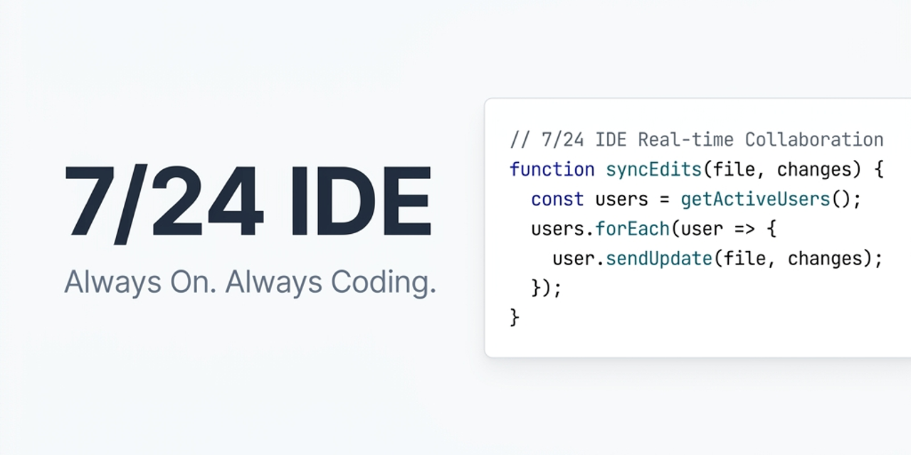

<div align="center">

#  7/24 IDE

### **Always On. Always Coding.**

**An autonomous, local AI developer agent for Windows.**
Describe what you want — it reads your files, writes precise edits, runs commands, and shows you a live preview, all inside your own project folder.

[](../../releases/latest)
[](LICENSE)
[](../../releases/latest)



</div>

---

## Why 7/24 IDE?

Standard AI chats make you copy-paste code blocks endlessly. Browser sandboxes trap you in tiny web demos with no way to install native packages or run real backends.

**7/24 IDE is different.** It's a focused, local workspace built around an autonomous developer agent. You describe a task; the agent reads your files, makes precise modifications, runs install/build scripts, and renders a live preview — like a junior developer working directly in your project folder, 24/7.

Everything runs **locally**. Your code, chats, settings and snapshots never leave your machine.

---

## Plan & Build — two ways to work

| Mode | Best for | How it works |
|------|----------|--------------|
| **⚡ Build** | Fixes, refactors, incremental changes | The agent edits files and runs commands immediately. A live activity bar shows what it's doing, which files changed, and token usage. |
| **🗺️ Plan** | Whole features from scratch | The agent drafts a step-by-step plan you approve. Each step runs in an isolated micro-agent inside a **shadow workspace**, merged only on success, with a sticky progress bar and self-healing on build errors. |

---

## Key Features

### ⚡ Native Rust Engine
An optional bundled Rust core builds real **Tree-sitter** syntax trees (Rust, TypeScript/TSX, JavaScript/JSX, Python, HTML, CSS, JSON) and ranks workspace code search with **BM25** relevance. The workspace is indexed in the background. If the binary isn't present, the app falls back transparently to its TypeScript implementation — no loss of functionality.

### 🤖 Smart Model Picker
Search hundreds of OpenRouter models in a clean dropdown with **FREE badges**, context-window and price labels, and tabs for *All / Free / ★ Favorites*. Pin favorites with a single star. Configure a **fallback model** for transient provider failures.

### 🦙 Ollama Offline Mode
Run fully private, offline builds. Select the Ollama provider, point it at your local endpoint (`http://localhost:11434`), fetch local models and tune the context window (`num_ctx`) — no cloud, no API key.

### 🛠️ Model Context Protocol (MCP)
Extend the agent with external stdio JSON-RPC MCP servers added straight from settings — database inspectors, search engines, web readers, formatters and more.

### 🛡️ Safety & Absolute Control
- **Auto-Checkpoints** — a silent snapshot is taken before every agent run; roll the whole project back in one click from the *Snapshots* tab.
- **Monaco Diff Reviews** — inspect every change side-by-side in a fullscreen diff before it touches disk.
- **Permissions Panel** — per-operation rules (Always Allow / Ask / Deny) for file reads, writes and command execution.
- **Folder-Scoped Sandbox** — the agent is locked inside your chosen workspace folder.

### 💬 2026-Ready Reasoning Chat
Collapsible reasoning blocks, clean tool-call cards, anti-truncation auto-continue, copy & Markdown export, and a readable centered chat column. Tool parsing tolerates model quote-style variations so actions keep running instead of leaking raw XML.

### 🖼️ Image Paste, Branching & Run-from-Chat
Paste (Ctrl+V) or drag-and-drop images as context. Branch any conversation to experiment without losing history. Run JavaScript/TypeScript/Python/Shell code blocks directly from chat with one click.

### 🤖 Smart Git Auto-Commits
Optionally stage and commit after each plan step with AI-generated messages. Verify/edit the message before it lands, and customize the prefix (defaults to `[AI]`).

### 🌍 Localized Interface
Full UI available in **English, Russian and Chinese**.

### ⌨️ Keyboard Shortcuts
| Shortcut | Action |
|----------|--------|
| `Ctrl+K` | Quick chat search |
| `Ctrl+L` | Clear chat / new |
| `Ctrl+Shift+M` | Toggle Build / Plan |
| `Ctrl+N` | New project |
| `Ctrl+,` | Open Settings |

---

## Quick Start

1. **Download & Install** the latest installer from the [Releases](../../releases/latest) page (`7-24-IDE-Setup-x.y.z.exe`), or grab the portable build.
2. **Pick a Workspace** — choose any folder on your computer where you want to build.
3. **Connect a Model** — paste an [OpenRouter](https://openrouter.ai/) API key for cloud models (Claude, GPT-4o, Gemini, Llama, etc.), *or* point to a local [Ollama](https://ollama.com) endpoint for fully offline work.
4. **Start Building** — describe what you want (e.g. *"Build a weather dashboard with city search"*), pick Build or Plan, and watch it come together.

Your API key is encrypted with the OS keychain (Windows DPAPI). All data lives locally in `%APPDATA%\7-24 IDE\`. No telemetry, no cloud storage, no lock-in.

---

## Under the Hood

- **Native Rust Core (`core-backend`):** spawned on startup over JSON-RPC stdio for Tree-sitter AST parsing and BM25 code search. Build it with `cargo build --release` in `core-backend/` — or just `npm run build` in `desktop-gui/`, which auto-detects `cargo` and bundles the binary as `extraResources`. Skipped gracefully if `cargo` is absent.
- **Dual-mode workspace:** Build (direct edits) and Plan (step-by-step checklist executed by isolated micro-agents in a shadow workspace).
- **AST compression:** large files are folded to signatures so they don't consume the whole context budget.
- **Self-evolving skills:** after a successful build the agent reflects on the session and compiles reusable rule sets that auto-activate on similar tasks.
- **Atomic writes:** files are written to a temp sibling and renamed, preventing corruption on interruption.
- **Prompt caching:** optimized system prompts for Anthropic models lower latency and cost.

---

## Building from Source

```bash
# Desktop app (Electron + TypeScript)
cd desktop-gui
npm install
npm run build      # bundles main/preload/renderer + Monaco (+ Rust core if cargo present)
npm start          # launch the app
npm test           # run the test suite
npm run dist       # build the Windows NSIS installer into ../dist-installer

# Native engine (optional, requires Rust toolchain)
cd core-backend
cargo build --release
```

---

## License

Released under the [MIT License](LICENSE).

<div align="center">
<sub>© 2026 7/24 IDE · Crafted with love and AI.</sub>
</div>
